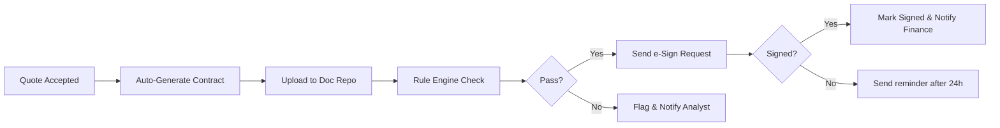
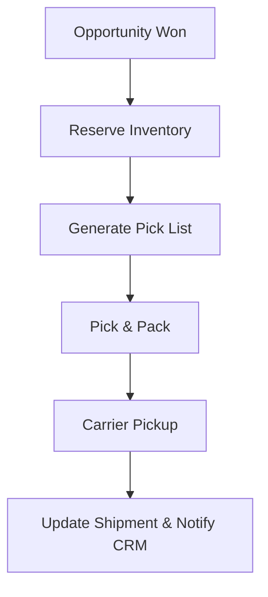
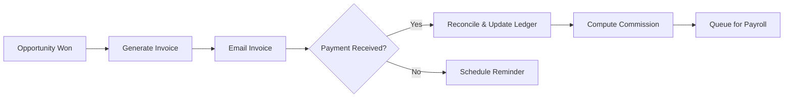
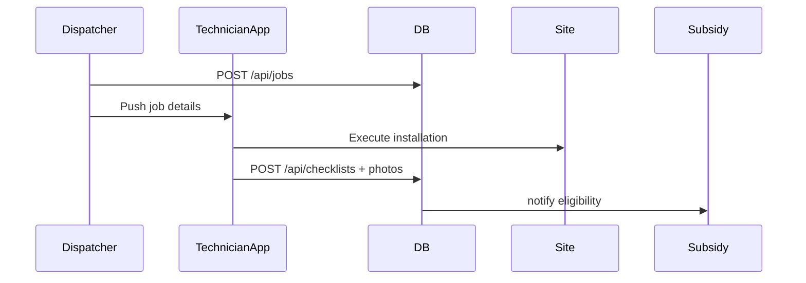
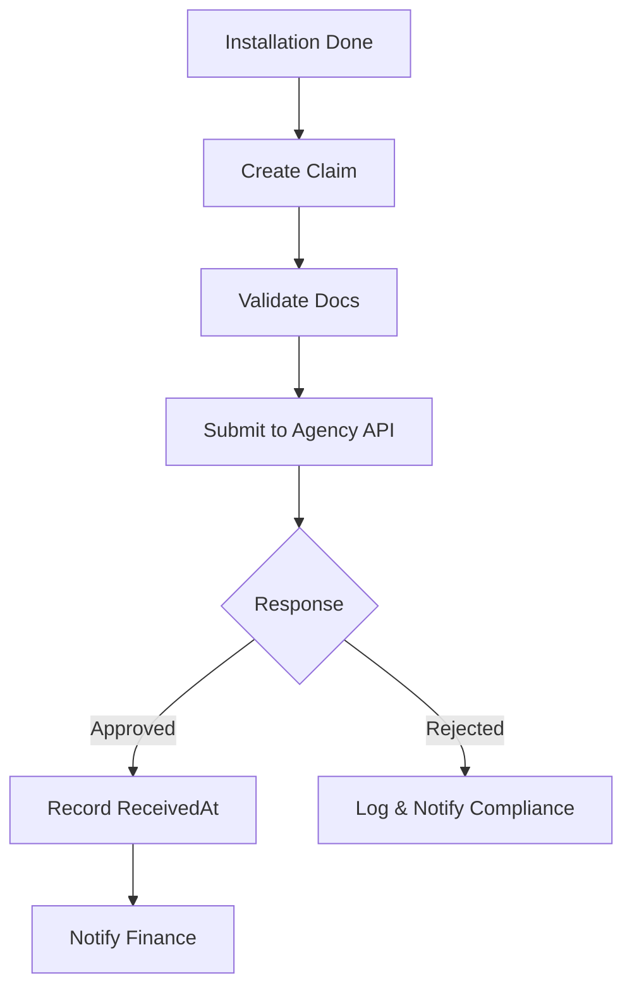
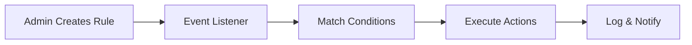

````markdown
# Module-Level Canvas: Solar Distributor CRM SaaS

> For each department, a “Module Canvas” captures Purpose, Objectives, Stakeholders, Inputs, Outputs, Key Activities, Data, UI, APIs, Workflows, Integrations, Metrics, Security, Risks, Dependencies, Retention, Audit, Maintenance, Success, Open Issues.

---

## Table of Contents

1. [Sales Department](#sales-department)  
2. [Tele-Communication Department](#tele-communication-department)  
3. [Documentation & Compliance Department](#documentation--compliance-department)  
4. [Warehouse & Inventory Department](#warehouse--inventory-department)  
5. [Accounts & Finance Department](#accounts--finance-department)  
6. [Service & Installation Department](#service--installation-department)    
7. [Subsidy Department](#subsidy-department)  
8. [Admin & Shared Services Department](#admin--shared-services-department)  
9. [Glossary](#glossary)  

---

## Sales Department

### Purpose
- Capture, qualify, and convert leads into revenue-generating opportunities.  
- Provide sales reps with tools to manage pipeline and close deals efficiently.  

### Objectives
1. Increase conversion rate from lead to opportunity by 20%  
2. Reduce average qualification time to < 48 hours  
3. Automate follow-up reminders and next-best actions  
4. Provide real-time visibility into pipeline health  

### Stakeholders
- **Internal:** Sales reps, Sales manager, Marketing team, Admin  
- **External:** Prospects, Field agents, Referral partners  

### Inputs
- Web form submissions  
- Field-agent app entries  
- Email-to-CRM parsing  
- Tele-Comm “Qualified” handoffs  

### Outputs
- Scored leads  
- Opportunities with expected close dates  
- Quotes PDF delivered to prospects  
- Activity logs for audit  

### User Journeys
1. **New Lead Intake** → Auto-assign → Rep views in Dashboard → First outreach  
2. **Hot Lead Engagement** → Opportunity creation → Quote sent → Contract  
3. **Cold Lead Nurture** → Drip campaign → Score re-evaluation  

### Key Activities
- Lead validation & enrichment  
- Assignment rules (round-robin, territory)  
- Lead scoring & qualification  
- Opportunity stage management  
- Quote building & approval  
- Automated email/SMS triggers  

### Key Data Entities
- **Lead:** id, source, contact, score, status  
- **Opportunity:** leadId, stage, amount, closeDate  
- **Quote:** opportunityId, items[], totalAmount, status  
- **Activity:** leadId/opportunityId, type, timestamp, details  

### UI Components
- Leads List (filter, sort, bulk actions)  
- Lead Detail Panel (timeline, qualification form)  
- Pipeline Board (drag-and-drop)  
- Quote Builder Modal (line items, PDF preview)  
- Dashboard Cards (KPIs, funnel chart)  

### API Endpoints
| Method | Endpoint                                  | Description                      |
| ------ | ----------------------------------------- | ---------------------------------|
| POST   | /api/leads                                | Create new lead                  |
| GET    | /api/leads?status=new|assigned|qualified  | List leads by status             |
| PUT    | /api/leads/:id/assign                     | Assign lead to rep               |
| PATCH  | /api/leads/:id/score                      | Update lead score                |
| POST   | /api/opportunities                        | Create opportunity               |
| PATCH  | /api/opportunities/:id                    | Update opportunity stage/amount  |
| POST   | /api/quotes                               | Generate quote                   |
| GET    | /api/quotes?status=sent|accepted|rejected | List quotes by status            |

### Workflow (Mermaid)

```mermaid
flowchart TD
  A[Lead Captured] --> B{Validate Data}
  B -- Invalid --> Z[Flag & Notify Admin]
  B -- Valid --> C[Assign to Rep]
  C --> D[Rep Outreach]
  D --> E{Score ≥ Threshold?}
  E -- No --> F[Nurture Campaign]
  F --> C
  E -- Yes --> G[Create Opportunity]
  G --> H[Build & Send Quote]
  H --> I{Quote Accepted?}
  I -- Yes --> J[Trigger Documentation]
  I -- No --> K[Schedule Follow-Up]
````

### Integrations

* **Tele-Comm:** REST callback updates lead status
* **Docs & Compliance:** POST /api/documents on quote acceptance
* **Warehouse:** POST /api/inventory/reserve on opportunity won
* **Finance:** POST /api/invoices when contract signed
* **Service:** POST /api/jobs on invoice payment
* **Subsidy:** Trigger claim creation on job completion

### Performance Metrics

* Lead → Opportunity conversion (%)
* Avg. time to qualify lead (hrs)
* Quotes sent per rep per week
* Win rate (%)
* Pipeline value vs. target

### Security & Compliance

* Role-based access: `auth('Sales')`
* Data validation & sanitization on inputs
* TLS encryption in transit
* Field-level encryption for PII

### Risks & Mitigations

* **Risk:** Duplicate leads → **Mitigation:** duplicate-detection service
* **Risk:** Assignment bias → **Mitigation:** adjustable rules & monitoring
* **Risk:** Email deliverability issues → **Mitigation:** provider failover

### Dependencies

* MongoDB for persistence
* 3rd-party enrichment API
* SMTP/SMS gateway
* Tele-Comm microservice

### Data Retention & Archival

* Leads archived after 1 year of inactivity
* Opportunity records retained 5 years

### Audit Logging

* Write audit entries on create/update/delete
* Store in `AuditLog` collection with userId, action, timestamp

### Maintenance & Backup

* Daily MongoDB backups
* Weekly index rebuilds
* Monitor disk usage & slow queries

### Success Criteria

* 20% uplift in conversion
* Sub-48-hour qualification SLA met 95% of time
* 30% reduction in manual follow-ups

### Open Issues

* Integration spec for AI-driven next-best actions
* UI design for custom quote templates

---

## Tele-Communication Department

### Purpose

* Profile incoming enquiries, conduct first-level outreach, route qualified contacts.

### Objectives

1. Reduce “Not Reachable” rate by 25%
2. Increase “Qualified” outcomes by 15%
3. Automate callback scheduling & reminders

### Stakeholders

* Telecallers, Tele-Comm Supervisor, Admin, Sales reps, Customers

### Inputs

* Unprofiled leads (status=Unknown)
* Call scripts & templates
* Communication channel configs

### Outputs

* Call records with outcomes
* Scheduled callbacks
* Campaign reports

### User Journeys

1. **New Enquiry** → Auto-assign → Telecaller profiles → outcome logged
2. **Callback** → system reminder → call → outcome
3. **Escalation** → complaint → Documentation ticket

### Key Activities

* Lead queue management
* Dynamic profiling forms
* Click-to-call / WhatsApp / SMS send
* Outcome logging & sentiment capture
* Auto-assignment & retry rules

### Key Data Entities

* **CallRecord:** id, leadId, telecallerId, outcome, notes, duration, timestamp
* **Campaign:** id, channel, template, schedule, status
* **Template:** id, channel, name, body, variables\[]

### UI Components

* Telecaller Dashboard (queue, filters)
* Profiling Form Modal
* Call Logger Panel (notes, recording link)
* Campaign Builder (template select, scheduling)
* Reports (heatmap, conversion rates)

### API Endpoints

| Method | Endpoint                  | Description            |                   |
| ------ | ------------------------- | ---------------------- | ----------------- |
| GET    | /api/calls?filter=today   | missed                 | List call records |
| POST   | /api/calls                | Log call outcome       |                   |
| GET    | /api/calls/\:id/recording | Retrieve recording URL |                   |
| GET    | /api/templates            | List message templates |                   |
| POST   | /api/campaigns            | Schedule bulk campaign |                   |
| ------ | ------------------------- | ---------------------- | ----------------- |


### Workflow (Mermaid)

```mermaid
sequenceDiagram
  participant TC as Telecaller
  participant CRM
  TC->>CRM: GET /api/calls?filter=unknown
  CRM-->>TC: Lead data + script
  TC->>Lead: calls/SMS/WhatsApp
  Lead-->>CRM: reply or no-answer
  TC->>CRM: POST /api/calls (outcome, notes)
  alt outcome=Interested
    CRM->>Sales: PATCH /api/leads/:id/status=Qualified
  else outcome=Complaint
    CRM->>Docs: POST /api/documents (complaint ticket)
  else outcome=Site Visit
    CRM->>Service: POST /api/jobs
  end
```

### Integrations

* **Sales:** PATCH lead.status on Qualified
* **Docs:** POST complaint docs
* **Service:** POST job scheduling
* **Finance:** append payment reminder logs
* **Warehouse:** push stock query logs

### Performance Metrics

* Calls per telecaller per day
* Qualification rate (%)
* Avg. time to first call (mins)
* Campaign send success (%)

### Security & Compliance

* RBAC `auth('TeleComm')`
* DNC list enforcement
* Recording storage encryption

### Risks & Mitigations

* High drop-off on first call → A/B test scripts
* Overload of callbacks → dynamic throttling

### Dependencies

* Telephony API (Exotel/Telnyx)
* WhatsApp Business API
* SMS gateway

### Data Retention & Archival

* Call records retained 6 months
* Campaign logs retained 1 year

### Audit Logging

* Log template changes, assignment rule edits

### Maintenance & Backup

* Monitor API rate limits
* Daily sync of DNC list

### Success Criteria

* 15% uplift in “Interested” outcomes
* 90% adherence to callback SLAs

### Open Issues

* Sentiment-analysis integration for calls
* WhatsApp template approval workflow

---

## Documentation & Compliance Department

### Purpose

* Verify contracts, KYC, compliance docs; manage e-signatures and approvals.

### Objectives

1. Achieve 99% first-pass accuracy in document checks
2. Automate 80% of compliance rule validations
3. Reduce manual rework by 50%

### Stakeholders

* Compliance officers, Legal team, Sales, Finance, Service, Subsidy

### Inputs

* Quotes accepted (contract drafts)
* KYC uploads, subsidy docs, installation certificates

### Outputs

* Signed contracts
* Compliance tickets for rejections
* Audit reports

### User Journeys

1. **Contract Drafted** → auto-generate PDF → officer reviews → send for e-sign
2. **Doc Upload** → system rule check → pass/fail → notify analyst
3. **Rejection** → manual follow-up → resubmit

### Key Activities

* Document ingestion & versioning
* Automated rule engine (GST, subsidy eligibility)
* E-signature integration & reminders
* Manual review & exception handling
* Audit trail maintenance

### Key Data Entities

* **Document:** id, type, relatedId, version, status, signedAt
* **Approval:** docId, approverId, status, timestamp

### UI Components

* Document Repository Tree
* Version History Viewer (diff)
* E-Sign Dashboard (pending, signed)
* Compliance Rule Editor (manager only)
* Audit Log Viewer

### API Endpoints

| Method | Endpoint                     | Description            |
| ------ | ---------------------------- | ---------------------- |
| POST   | /api/documents               | Upload new doc version |
| GET    | /api/documents/\:id/versions | List versions          |
| POST   | /api/documents/\:id/sign     | Initiate e-sign        |
| POST   | /api/approvals               | Approve/reject doc     |

### Workflow (Mermaid)



### Integrations

* **Sales:** receive quote data
* **Finance:** push signed contract for invoice
* **Service:** attach permit docs
* **Subsidy:** deliver compliance docs for claims

### Performance Metrics

* First-pass doc acceptance rate
* Avg. time to sign (hrs)
* Rule engine coverage (%)

### Security & Compliance

* TLS & encryption at rest for documents
* Access logs for doc downloads
* GDPR data handling

### Risks & Mitigations

* Expired e-sign links → auto-renew tokens
* Incorrect rule definitions → versioned rule sets

### Dependencies

* S3 or equivalent object storage
* E-sign provider (DocuSign/EasySign)
* Rule engine microservice

### Data Retention & Archival

* Docs retained 7 years (legal requirement)
* Versions purged after 10 years

### Audit Logging

* Immutable event logs for all doc actions

### Maintenance & Backup

* Weekly storage health checks
* Archive to cold storage

### Success Criteria

* 99% doc accuracy
* < 24 h turnaround for compliance checks

### Open Issues

* Dynamic rule updates without service restart
* Multi-signer workflows

---

## Warehouse & Inventory Department

### Purpose

* Manage inbound/outbound stock, ensure availability for sales and service.

### Objectives

1. Maintain ≥ 95% stock accuracy
2. Automate reorder at defined thresholds
3. Reduce pick-pack errors by 30%

### Stakeholders

* Warehouse staff, Inventory manager, Sales, Service, Accounts

### Inputs

* Purchase receipts, sales reservations, service job requirements

### Outputs

* Updated stock levels, pick lists, shipment records

### User Journeys

1. **Goods Receipt** → QC → put-away → update stock
2. **Order Pick** → pick-list print → pack → dispatch
3. **Cycle Count** → scan → reconcile differences

### Key Activities

* Stock receipt & QC
* Real-time inventory updates
* Reservation & release for orders/jobs
* Pick-pack list generation
* Returns/damages processing
* Cycle counting & audits

### Key Data Entities

* **InventoryItem:** sku, locationId, qtyOnHand, reorderLevel
* **OrderReservation:** orderId, sku, qtyReserved
* **Shipment:** id, orderId, carrier, trackingNumber, status

### UI Components

* Inventory Dashboard (heatmap, alerts)
* Receipt Entry Form (PO scan, qty input)
* Pick List PDF generator
* Shipment Tracker

### API Endpoints

| Method | Endpoint                  | Description             |
| ------ | ------------------------- | ----------------------- |
| GET    | /api/inventory            | Stock overview          |
| POST   | /api/inventory/reserve    | Reserve stock for order |
| POST   | /api/shipments            | Create shipment record  |
| GET    | /api/shipments/\:id/track | Track shipment status   |

### Workflow (Mermaid)



### Integrations

* **Sales:** reserve stock on opportunity won
* **Service:** material pull for jobs
* **Finance:** cost sync for COGS
* **Admin:** master SKU data sync

### Performance Metrics

* Stock accuracy (%)
* Order fill rate (%)
* Pick-pack error rate

### Security & Compliance

* Access control per location
* Audit trail for adjustments

### Risks & Mitigations

* Overstock/understock → adjustable reorder levels
* Location mix-ups → barcode scans

### Dependencies

* Barcode scanner integration
* ERP sync microservice

### Data Retention & Archival

* Shipment logs retained 3 years
* Stock snapshots daily

### Audit Logging

* Log physical adjustments, reservations

### Maintenance & Backup

* Database replication & backup
* Warehouse mobile app offline sync

### Success Criteria

* ≥ 95% stock accuracy
* ≤ 2% pick-pack errors

### Open Issues

* Dynamic location optimization
* Integration with 3PL APIs

---

## Accounts & Finance Department

### Purpose

* Generate invoices, process payments, manage subsidy receivables and expenses.

### Objectives

1. Automate 90% of invoicing workflows
2. Maintain DSO < 30 days
3. Reconcile subsidy receipts monthly

### Stakeholders

* Finance clerks, Finance manager, Sales, Subsidy, Admin

### Inputs

* Won opportunities, payment confirmations, subsidy approvals, vendor bills

### Outputs

* Invoices, receipts, commission reports, financial statements

### User Journeys

1. **Opportunity Won** → create Pro-Forma invoice → customer approval → final invoice
2. **Payment Received** → auto-reconcile → update ledger
3. **Subsidy Received** → match claim → update receivable

### Key Activities

* Invoice generation & delivery
* Payment gateway integration & auto-reconcile
* Commission calculation
* Subsidy receivable management
* Expense & vendor bill processing
* Financial reporting & compliance

### Key Data Entities

* **Invoice:** id, opportunityId, issuedAt, dueDate, status
* **Payment:** invoiceId, amount, method, receivedAt
* **Commission:** repId, amount, period, paid
* **Expense:** id, vendorId, amount, date, status

### UI Components

* Invoice Center (filter, bulk send)
* Payment Entry Form (auto-fill, reconcile)
* Commission Dashboard (leaderboard)
* Expense Approval Queue

### API Endpoints

| Method | Endpoint                        | Description           |
| ------ | ------------------------------- | --------------------- |
| POST   | /api/invoices                   | Create invoice        |
| GET    | /api/invoices?status=overdue    | List overdue invoices |
| POST   | /api/payments                   | Record payment        |
| GET    | /api/commissions?period=YYYY-MM | Commission report     |

### Workflow (Mermaid)



### Integrations

* **Sales:** invoice trigger on contract signed
* **Docs:** attach signed contract PDFs
* **Warehouse:** COGS sync
* **Service:** service fees
* **Subsidy:** receivable posting
* **Admin:** export financial policies

### Performance Metrics

* Days Sales Outstanding (DSO)
* Invoice aging distribution
* Auto-reconcile rate (%)

### Security & Compliance

* Sensitive data encryption
* Role-based access `auth('Finance')`
* Audit logs for adjustments

### Risks & Mitigations

* Payment gateway downtime → backup gateway
* Manual reconciliation errors → periodic audits

### Dependencies

* Payment gateway (Razorpay/Stripe)
* Subsidy API interface

### Data Retention & Archival

* Financial records retained 8 years (legal)
* Audit logs 10 years

### Audit Logging

* Ledger entry history

### Maintenance & Backup

* Nightly DB backups
* End-of-month close procedures

### Success Criteria

* DSO < 30 days
* 90% auto-reconcile

### Open Issues

* Multi-currency support
* Real-time bank statement imports

---

## Service & Installation Department

### Purpose

* Schedule, execute, and close installation/maintenance jobs onsite.

### Objectives

1. Increase on-time completion to 98%
2. Reduce rework rate by 20%
3. Enable offline mobile support

### Stakeholders

* Dispatchers, Technicians, Customers, Warehouse, Admin

### Inputs

* Site-visit required flags, material availability, technician schedules

### Outputs

* Completed job reports, handover certificates, NPS feedback

### User Journeys

1. **Dispatch** → assign tech → notify → onsite visit → complete checklist
2. **Job Update** → technician app logs steps & photos → sync
3. **Completion** → generate handover pack → digital sign-off → feedback survey

### Key Activities

* Work order creation & assignment
* Calendar scheduling & zone optimization
* Material requisitions & pick-lists
* Mobile app guided checklists
* Photo & meter-reading capture
* Digital handover & warranty

### Key Data Entities

* **Job:** id, accountId, type, scheduledAt, status
* **ChecklistItem:** jobId, step, completedAt, photoUrl
* **ServiceTicket:** id, accountId, issueType, priority, status

### UI Components

* Dispatcher Dashboard (map + calendar)
* Job Detail View (checklist, photos)
* Technician Mobile PWA
* Tickets & SLA Monitor

### API Endpoints

| Method | Endpoint              | Description        |
| ------ | --------------------- | ------------------ |
| POST   | /api/jobs             | Schedule new job   |
| PATCH  | /api/jobs/\:id/status | Update job status  |
| POST   | /api/checklists       | Log checklist step |
| POST   | /api/service-tickets  | Create ticket      |

### Workflow (Mermaid)



### Integrations

* **Sales:** job generation on opportunity won
* **Warehouse:** material pick & reserve
* **Docs:** attach inspection certificates
* **Finance:** invoice on completion
* **Subsidy:** installation data for claims

### Performance Metrics

* On-time completion rate
* Rework / revisit rate
* Technician utilization

### Security & Compliance

* Offline data encryption
* Customer privacy protection

### Risks & Mitigations

* Weather delays → auto-reschedule logic
* Offline sync conflicts → conflict resolution UI

### Dependencies

* Mobile PWA framework
* Geolocation & mapping API

### Data Retention & Archival

* Job records 5 years
* Photos 2 years

### Audit Logging

* Job status changes & times

### Maintenance & Backup

* App version auto-updates
* Offline cache expiry

### Success Criteria

* ≥ 98% on-time
* < 5% rework

### Open Issues

* Integration with customer portal for rescheduling

---

## Subsidy Department

### Purpose

* Automate subsidy claim creation, submission, tracking, and reconciliation.

### Objectives

1. Submit 100% of eligible claims within 7 days of installation
2. Reduce rejection rate to < 5%
3. Sync approvals automatically to finance

### Stakeholders

* Subsidy agents, Finance, Service, Docs, Government APIs

### Inputs

* Completed installations (job data), compliance docs

### Outputs

* Claims submitted, agency responses, receivables entries

### User Journeys

1. **Post-Install** → create claim → validate docs → submit
2. **Agency Response** → auto-update status → notify finance
3. **Rejection** → log reason → resend after correction

### Key Activities

* Claim creation & document bundling
* Eligibility rule checks
* Batch submission to agency API
* Response polling & status updates
* Rejection handling & resubmission

### Key Data Entities

* **SubsidyClaim:** id, jobId, expectedAmount, status, submittedAt, receivedAt
* **RejectionLog:** claimId, reason, timestamp

### UI Components

* Claim Dashboard (by status)
* Document Binder (drag-drop, validate)
* Submission History & Logs

### API Endpoints

| Method | Endpoint                           | Description         |
| ------ | ---------------------------------- | ------------------- |
| POST   | /api/subsidy-claims                | Create new claim    |
| GET    | /api/subsidy-claims?status=pending | List pending claims |
| PATCH  | /api/subsidy-claims/\:id           | Update claim status |

### Workflow (Mermaid)



### Integrations

* **Service:** installation triggers
* **Docs:** compliance docs attachment
* **Finance:** receivable postings
* **Admin:** configure eligibility rules

### Performance Metrics

* Claim submission turnaround (days)
* Approval rate (%)
* Rejection rate (%)

### Security & Compliance

* PII encryption
* Audit logs for submissions

### Risks & Mitigations

* API downtime → retry with backoff
* Incorrect docs → pre-submission validation

### Dependencies

* Government agency API credentials
* PDF/A conversion service

### Data Retention & Archival

* Claim records 7 years
* Rejection logs 10 years

### Audit Logging

* Submission & status update events

### Maintenance & Backup

* Daily sync with agency status
* Archive old claims to cold storage

### Success Criteria

* 100% timely submissions
* < 5% rejection

### Open Issues

* Multi-state subsidy variations
* Bulk claim import

---

## Admin & Shared Services Department

### Purpose

* Central configuration: users, roles, rules, notifications, system-wide support.

### Objectives

1. Provide secure RBAC for all modules
2. Automate system alerts & reports
3. Triage & resolve support tickets within SLA

### Stakeholders

* All department heads, IT, Executive team

### Inputs

* User registration requests, rule definitions, support tickets

### Outputs

* Active user accounts, notification broadcasts, scheduled reports

### User Journeys

1. **Onboard User** → grant department access → send credentials
2. **Define Rule** → configure event triggers → activate
3. **Support Ticket** → triage → assign → resolve

### Key Activities

* User & role provisioning
* Global settings (hours, SLAs, time-zones)
* Rule engine configuration
* Support ticket management
* Notification & alert distribution
* Report scheduling

### Key Data Entities

* **User:** id, name, email, department, role
* **Rule:** id, trigger, conditions, actions
* **Notification:** id, userId, message, read
* **Ticket:** id, dept, priority, status, assignee

### UI Components

* Admin Console (user/grid view)
* Role & Permission Editor
* Rule Builder (visual)
* Support Ticket Queue
* Notification Center
* Scheduled Reports Dashboard

### API Endpoints

| Method | Endpoint             | Description                   |
| ------ | -------------------- | ----------------------------- |
| POST   | /api/users           | Create user                   |
| PATCH  | /api/users/\:id/role | Change user role/department   |
| POST   | /api/rules           | Create/update automation rule |
| GET    | /api/notifications   | Fetch user notifications      |
| POST   | /api/tickets         | Create support ticket         |
| PATCH  | /api/tickets/\:id    | Update ticket                 |

### Workflow (Mermaid)



### Integrations

* **All Depts:** listen to domain events
* **Email/SMS gateways:** broadcast notifications
* **Reporting:** compile cross-module data

### Performance Metrics

* Ticket resolution time
* Daily active users count
* Rule execution success rate

### Security & Compliance

* MFA for Admin
* Audit trail of role changes
* TLS & encryption

### Risks & Mitigations

* Misconfigured rules → dry-run mode
* Unauthorized access → strict RBAC

### Dependencies

* Auth microservice
* Notification service
* Ticketing subsystem

### Data Retention & Archival

* User logs 3 years
* Ticket data 5 years

### Audit Logging

* Role changes, rule edits, ticket actions

### Maintenance & Backup

* Nightly config backups
* Simulation tests for rules

### Success Criteria

* 0 unauthorized access breaches
* 95% ticket SLA compliance

### Open Issues

* Self-service password reset
* Rule version rollback

---

## Glossary

* **CRM:** Customer Relationship Management
* **RBAC:** Role-Based Access Control
* **POC:** Proof of Concept
* **SLA:** Service Level Agreement
* **DSO:** Days Sales Outstanding
* **COGS:** Cost of Goods Sold
* **NPS:** Net Promoter Score
* **DNC:** Do Not Call List
* **JWT:** JSON Web Token
* **PWA:** Progressive Web App
* **API:** Application Programming Interface
* **PDF/A:** ISO-standardized PDF for archiving
* **MFA:** Multi-Factor Authentication
* **ERP:** Enterprise Resource Planning

---

*End of Module Canvas document.*
